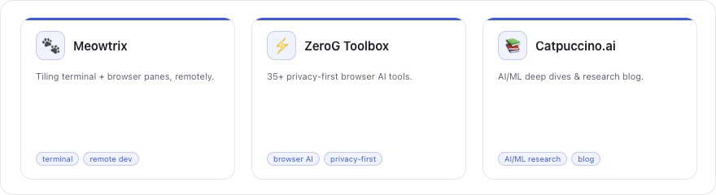

## About me 👋

**→ [View my full profile](https://tianhaoz95.github.io/tianhaoz95/)** — bio, skills, and the full project gallery.

<!--
  For more details on how to add more badges, check the documentation at
  https://shields.io (or the repository at https://github.com/badges/shields).
-->

- **Ask me about** 💬
  - Inference engine 🚀
  - RLVR 🤖
- **Fun fact** ⚡
  - A boba a day keeps bugs away.

## Projects 🛠️

<a href="https://tianhaoz95.github.io/tianhaoz95/">
  <picture>
    <source media="(prefers-color-scheme: dark)" srcset="pages/card-cycle-dark.gif">
    <source media="(prefers-color-scheme: light)" srcset="pages/card-cycle.gif">
    
  </picture>
</a>
